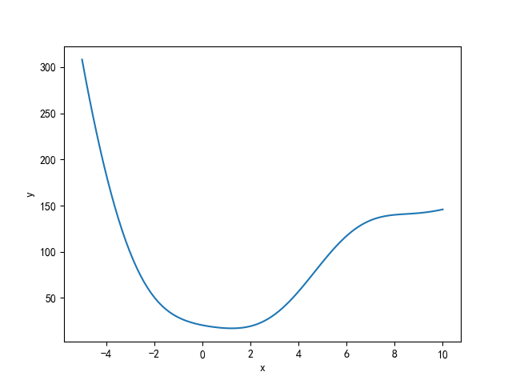

Branin
=================================

::
	
	from benchmark.branin import Branin
	matplotlib.pyplot as plt
	import numpy as np
	
	num = 100
    ndim = 2
    x = np.ones((num, ndim))

    x[:, 0] = np.linspace(-5, 10.0, num)
    x[:, 1] = np.linspace(0, 15.0, num)
    s = Branin()
    dataSet = s(x)
    plt.plot(dataSet["input"][:, 0], dataSet["output"][:, 0])
    plt.xlabel("x")
    plt.ylabel("y")
    plt.show()
	

