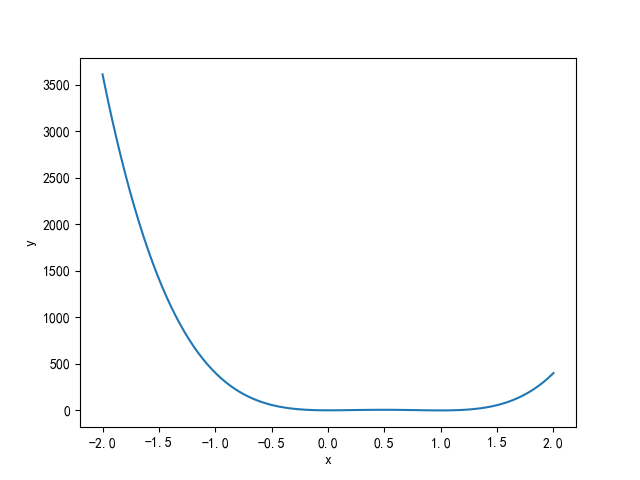

Rosenbrock
=================================

代码示例如下：::

    num = 100
    ndim = 2
    x = np.ones((num, ndim))

    x[:, 0] = np.linspace(-2, 2, num)
    x[:, 1] = np.linspace(-2, 2, num)
    s = Rosenbrock()
    dataSet = s(x)
    plt.plot(dataSet["input"][:, 0], dataSet["output"][:, 0])
    plt.xlabel("x")
    plt.ylabel("y")
    plt.show()
    print(dataSet)
    print(s(np.array([[-5, 0]])))

