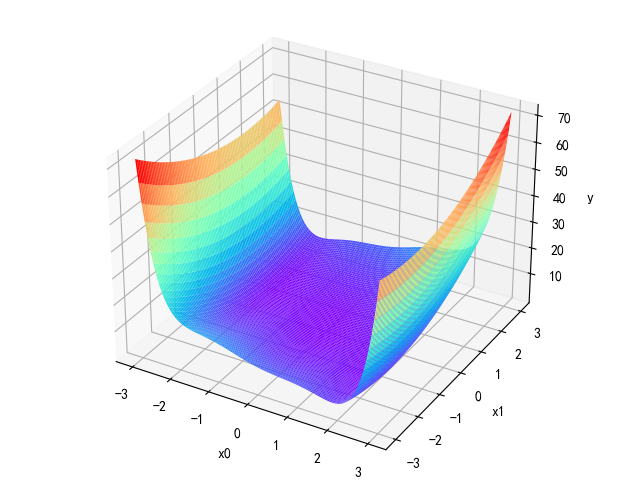

ThreeHumpCamel
=================================

代码示例如下：::

    from mpl_toolkits.mplot3d import Axes3D
	
    #3维图
    # 作图的x轴定义
    x1_plot = np.linspace(-3, 3, 100)
    x2_plot = np.linspace(-3, 3, 100)
    # 转换格式
    x1_plot, x2_plot = np.meshgrid(x1_plot, x2_plot)

    print("开始绘画")
    # 图片定义
    fig = plt.figure()
    ax2 = Axes3D(fig)

    # 画曲面图的z轴定义为
    z_plot = np.zeros((x1_plot.shape[0], x1_plot.shape[1]))
    for i in range(x1_plot.shape[0]):
        for j in range(x1_plot.shape[1]):
            t = ThreeHumpCamel()
            dataSet = t(np.array([[x1_plot[i][j], x2_plot[i][j]]]))
            z_plot[i][j] = np.squeeze(dataSet["output"])

    # 画出曲面
    ax2.plot_surface(x1_plot, x2_plot, z_plot, rstride=1, cstride=1, cmap='rainbow')
    ax2.set_xlabel("x0")
    ax2.set_ylabel("x1")
    ax2.set_zlabel("y")
    plt.show()

