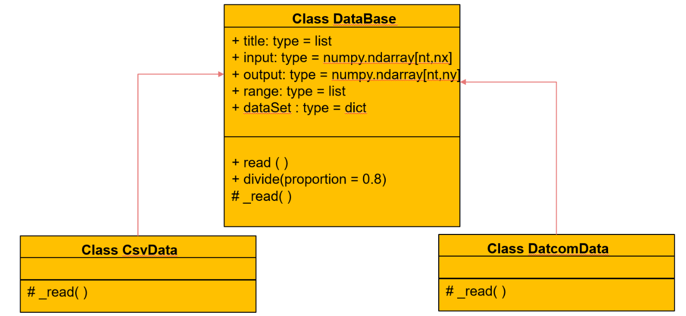

数据模块——数据读取
=================================

数据读取的部分功能为从不同格式的数据中获取规定的数据字典。其类图如下：

数据字典的内容如下：

======  ================  ========================
key        含义               value类型
======  ================  ========================
input    输入参数的取值    numpy.ndarray[nt, nx]
output   输出参数的取值    numpy.ndarray[nt, ny]
title    参数的名称            list
range    参数的范围            list
======  ================  ========================

.. toctree::
   :maxdepth: 1

   csv文件

DataBase为数据读取部分的基类，他的不同子类对应着的是不同来源不同格式的数据文件。

**DataBase中的属性**

======== ============== ===============================
名称       类型             含义
======== ============== ===============================
input    ndarray[nt,nx]  数据集的输入部分
output   ndarray[nt,ny]  数据集的输出部分
range      list           每一个参数的取值范围信息
title      list           数据集的参数名称
dataSet    dict           包含数据所有信息的dict
======== ============== ===============================

**DataBase中的API**

======================     =====================================
名称                         作用
======================     =====================================
read()                      将规定格式的文件读取为数据dict
divide(proportion)           划分数据集和样本集
======================     =====================================

**__init__(path,*args)**

构造函数，用于传入需要操作的数据文件路径

参数：

* path，类型为str，单条数据的路径
* args，类型为str，单条数据的路径，可以重复输入

示例：::

	from data import CsvData
	datapath = “C:\data\测试1.csv”
	D = CsvData (datapath)

**read() → dict**

读取传进去的数据

参数：None

返回：
* dataSet，类型为dict，包含数据所有信息的字典

示例：::

	from data import CsvData
	datapath = “C:\data\测试1.csv”
	D = CsvData (datapath)
	dataSet= D.read ()
	
**divide(proportion=0.8) → dict**

将数据集按照一定的比例划分为训练集和样本集

参数：

* proportion，类型为float，默认为0.8，训练集占总体数据集的比例

返回：

* trainSet，testSet，类型均为为dict，训练集和测试集

示例：::

	from data import CsvData
	datapath = “C:\data\测试1.csv”
	D = CsvData (datapath)
	dataSet= D.read ()
	train，test = D.divide(proportion = 0.7)

   

