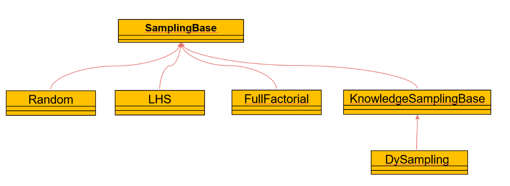

采样
=================================

KfSMT 提供了多种不同的采样方式在采样空间中生成一系列的样本点，用于后续的训练等任务，包括不融合知识的采样方式和融合知识的采样方式。

.. toctree::
   :maxdepth: 1
   
   简单随机采样
   拉丁超立方采样
   全因素采样
   动态采样
   
采样部分的类图如下：

	
SampingBase为所有采样方法的基类，Random对应着简单随机采样，LHS为拉丁超立方采样，FullFactorial为全因素采样。
KnowledgeSamplingBase为融合知识进行采样的基类，DySampling为融合知识的动态采样。

**SampingBase类中的属性**

======= ====== ===================================================
名称     类型    含义
======= ====== ===================================================
xlimts   dict   需要采样的参数和其对应的采样区间
======= ====== ===================================================

**SampingBase类中的API**

=========================  ==============================================
名称                          作用
=========================  ==============================================
sample(nt,table = None)     按照划定的采样空间生成一定数量的采样点
=========================  ==============================================

**__init__（xlimts）**

构造函数，用于传入xlimts

参数：

* xlimts，类型为dict，需要采样的参数和其对应的采样区间

示例：::

	from data import LHS
	xlimts = {“x1”: [0,60], “x2”: [0,40] , “x3”: [0,15]}
	lhs = LHS (xlimts)

**sample（nt, table = None）→ ndarray[nt,nx]**

采样函数,可以选择是否生成采样表

参数：

* nt, 类型为int，生成采样点的个数
* table，默认为None，可以接受str格式，生成采样表的路径，默认不生成采样表

返回：

* ndarray[nt,nx]，生成的采样点矩阵，nt为采样点的个数，nx为输入的维度

示例：::

	from data import LHS
	xlimts = {“x1”: [0,60], “x2”: [0,40] , “x3”: [0,15]}
	lhs = LHS (xlimts)
	points = lhs.sample (100)

**KnowledgeSamplingBase类中的属性**

============= =======    =======================================
名称           类型        含义
============= =======    =======================================
knowledgeSet   list        采样过程中需要使用到的知识集合
============= =======    =======================================

**KnowledgeSamplingBase类中的API**

==========================================   =========================
名称	                                       作用
==========================================   =========================
setKnowledge (*args,knowledgeList = None)      设置采样所需要的知识
==========================================   =========================

**setKnowledge (*args,knowledgeList) → None （只有空间型的知识）**

设置采样需要的知识

参数：

* args, 类型为dict，需要的知识字典，可以重复输入
* knowledgelist，默认为None，可接受的类型为list，多条知识dict组成的集合。

返回：None

示例：::

	from data import DySampling
	from knowledge import KnowledgeSet
	set = Knowledge("C:\data\测试1.txt", "C:\data\测试2.txt", "C:\data\测试3.txt",knowledgeList = ["C:\data\测试4.txt", "C:\data\测试5.txt", "C:\data\测试6.txt"])               
	#将多条xml格式的知识读取为知识list
	Knowlist = set.readknowledge()
	xlimts = {“x1”: [0,60], “x2”: [0,40] , “x3”: [0,15]}             
	#设置采样区间
	Dy = DySampling (xlimts)
	Dy. setKnowledge (knowledgeList = Knowlist)
	#设置知识

