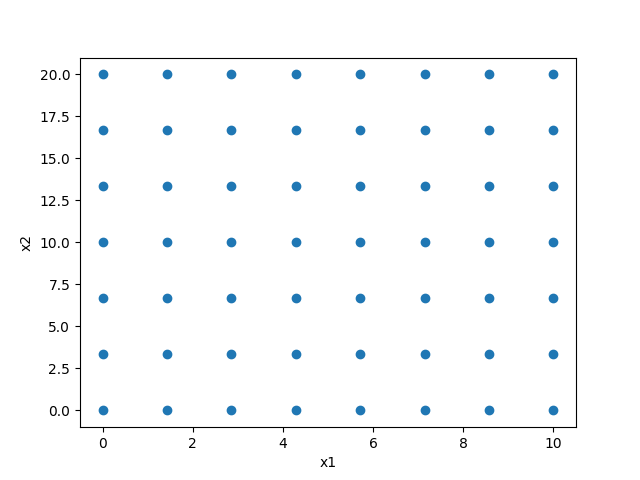

=========================
全因素采样
=========================

**LatinHypercubeSampling中的属性**

=========== ===========  ================================
名称           类型         含义
=========== ===========  ================================
clip           bool       是否将样本数取整到每个 nx 维度
=========== ===========  ================================

::

    xlimts = {"x1": [0, 10], "x2": [0, 20]}
    s = FullFactorialSampling(xlimts)
    s.clip = True
    points = s.sample(50, tablePath=path)
    print(points)

    # 画图展示
    plt.plot(points[:, 0], points[:, 1], "o")
    plt.xlabel(s.xTitle[0])
    plt.ylabel(s.xTitle[1])
    plt.show()

