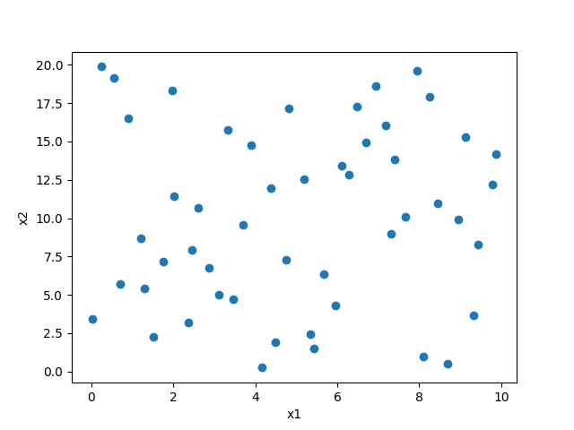

=========================
拉丁超立方采样
=========================

拉丁超立方的采样方法

**LatinHypercubeSampling中的属性**

=========== ===========  ==============================
名称           类型         含义
=========== ===========  ==============================
criterion       str         用于构建 LHS 设计的标准
=========== ===========  ==============================

criterion,类型为str，默认为"c"，可选的范围有["center", "maximin", "centermaximin", "correlation", "c", "m", "cm", "corr",
"ese"]，用于构建 LHS 设计的标准， c、m、cm 和 corr 分别是 center、maximin、centermaximin 和correlation, respectively，
分别为将采样间隔内的点居中、最大化点之间的最小距离，并将点放置在其间隔内的随机位置、最大化点之间的最小距离并在其间隔内将点居中、最小化最大相关系数、
使用增强随机进化算法 (ESE) 优化设计。

::

    xlimts = {"x1": [0, 10], "x2": [0, 20]}
    s = LatinHypercubeSampling(xlimts)
    s.criterion = "m"
    points = s.sample(50, tablePath=path)
    print(points)

    # 画图展示
    plt.plot(points[:, 0], points[:, 1], "o")
    plt.xlabel(s.xTitle[0])
    plt.ylabel(s.xTitle[1])
    plt.show()

