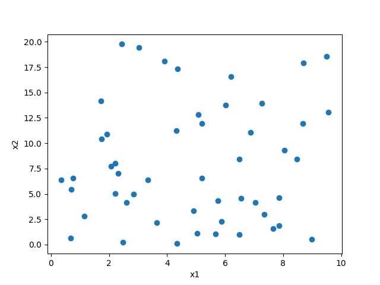

=========================
简单随机采样
=========================

**代码示例**

::

    path = r"C:\data\采样表示例.csv"
    xlimts = {"x1": [0, 10], "x2": [0, 20]}
    s = RandomSampling(xlimts)
    points = s.sample(50, tablePath=path)
	
	# 画图展示
    plt.plot(points[:, 0], points[:, 1], "o")
    plt.xlabel(s.xTitle[0])
    plt.ylabel(s.xTitle[1])
    plt.show()
	

