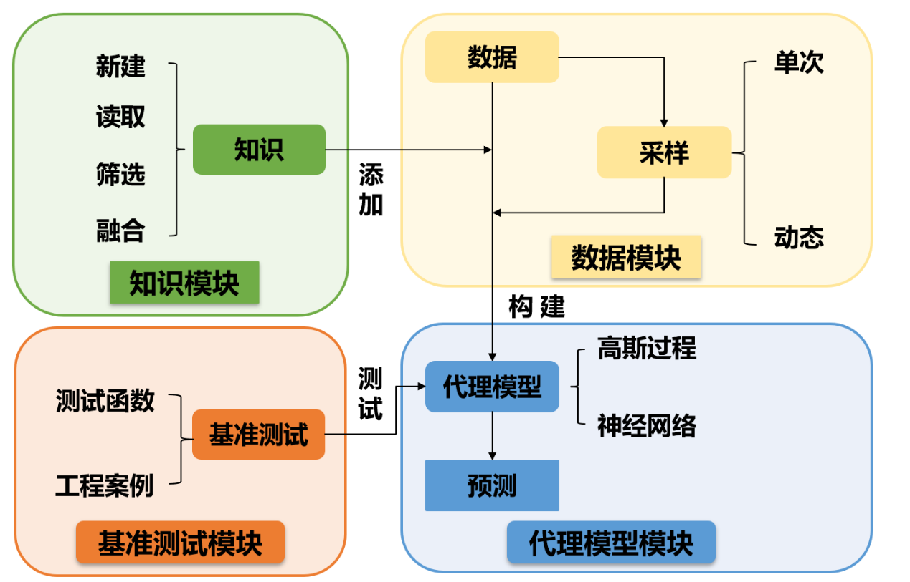

.. KfSMT documentation master file, created by
   sphinx-quickstart on Mon Sep 19 15:25:36 2022.
   You can adapt this file completely to your liking, but it should at least
   contain the root `toctree` directive.

KfSMT的说明文档
===========================================================================================

融合知识代理模型工具包（Knowledge-fused Surrogate Modeling Toolbox,KfSMT）为知识和数据混合驱动的代理模型工具包，主要分为4个部分：知识模块、数据模块、代理模型模块、基准测试模块。

工具包的特性
---------------------

在工程问题中，使用代理模型代替昂贵的计算与计算机模拟已被广泛地应用。然而，在设计复杂产品时，由于通过仿真试验或者实物试验获得数据的成本较高，往往只能获得有限的数据。仅利用这些数据构建代理模型，其精度往往达不到设计人员需要的精度。可以从两个思路上去解决这一问题：

**添加知识约束**

工程设计领域内的代理模型从本质来说是设计问题中变量之间的映射规律。而小数据问题中，过于少的数据量致使了变量之间一些映射关系信息缺失，从而导致构建出的代理模型精度达不到要求。考虑到在工程领域，设计人员在多年的设计过程中积累了一定的知识，即对于设计问题本身的映射规律有着一定的认识，这些知识可以补充因小数据缺失的映射关系信息，从而提高代理模型的精度。

**提高数据质量**

因为数据获取的成本问题，能够获取数据的数量有限。为了提高代理模型的精度，就要求每一个数据点的质量尽可能的高。可以定义数据的效用函数，利用序贯式采样的思想，最大化每次采点的效用函数，从而获得质量更好的数据点，提高代理模型的精度。
基于以上的两种思路，构建了融合知识的代理模型构建Python工具包。

工具包内的工作流程
--------------------------

工具包的构建思路主要是依照代理模型的创建流程。在数据驱动的代理模型构建过程中，从各种数据来源获取数据之后，经过处理，转化为代理模型支持的数据格式，然后选择合适的算法，进行训练和预测等操作。而在所提出的融合知识代理模型的工作流程中，代理模型的训练除了需要数据集外，还需要知识的参与。
所以，整个工具包分为4个模块：知识模块、数据模块、代理模型模块和基准测试模块。

在知识模块中，主要涉及到对知识的处理。包括：新建知识，设计人员利用此部分的功能，将自己在设计实践中积累的工程经验表征为不同类型的知识，并以xml格式的文件储存下来；读取知识，将这些xml格式的知识文件读取为后续构建代理模型和进行动态采样支持的格式；
筛选知识，设计人员提供的这些知识并不能保证完全的正确性，而错误知识的加入会影响到后续的工作流程，此功能的目的是以不同的指标筛选出正确的知识；融合知识，在构建融合知识的代理模型时，多条目的知识，若各自作为条件融合进代理模型中，会增加优化目标数量，
从而影响模型的收敛效率。此功能会将多条知识融合为一条，来避免上述问题的发生。

在数据模块中，主要功能为数据读取和采样。由于数据来源的不同，所产生的数据文件格式，除了包中所定义的csv文件格式以外，也会有其他各种各样的数据格式。使用此功能，可以将这些不同格式的数据文件按照一定的规范读取为后续的各种操作能够接受的格式。
采样部分，则是当现有的数据不足时，利用DOE的原理，生成一些采样点以获取新的数据。主要可分为单次采样和融合知识的序贯式采样，后者利用到知识信息和少量的初始数据信息可以有效提高新获取的数据质量。

在代理模型模块中，负责代理模型构建和使用代理模型进行预测。将通过上述流程中得到的数据与知识，输入到该模块中，进行代理模型的训练，并且可以使用完成后的代理模型完成预测工作。

在基准测试的模块中，包含了一些常用的基准测试函数和工程案例，方便用来进行测试。

.. toctree::
   :maxdepth: 3

   
   knowledge/index

