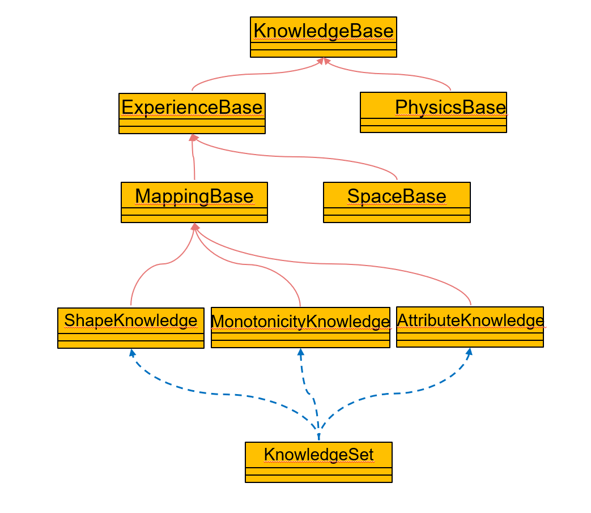
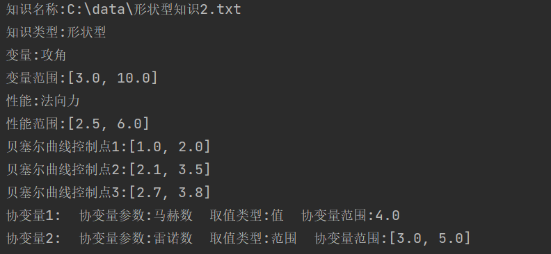

单条目知识
=================================
该部分的功能为对单条知识的操作，包括知识的读取、查看和新建。该部分的类图如下所示，代表着不同类型的知识。
KnowledgeBase为所有知识的基类，ExperienceBase为经验型知识（工程经验），PhysicsBase为物理知识，MappingBase和SpaceBase为工程经验中的映射型知识和空间型知识，ShapeKnowledge（形状型知识）、MonotonicityKnowledge（单调型知识）、AttributeKnowledge（属性型知识）则为映射型知识中的具体种类。

	
.. toctree::
   :maxdepth: 1
   
   形状型知识
   单调型知识
   属性型知识
   
+++++++++++++++
使用说明
+++++++++++++++

**KnowledgeBase中的属性**

==========   ======   ===============================================================  
名称          类型      含义 
==========   ======   =============================================================== 
path          str     储存知识文件的路径
True          str     知识的具体类型，如“形状型”、“单调型”等等
knowledge     dict    包含着所有知识信息的字典，可以用于后续的代理模型构建等操作
==========   ======   ===============================================================  

**KnowledgeBase中的API**

=================   ====================================
名称                 作用
=================   ====================================
readKnowledge()	    将xml文件格式的知识读取为 dict格式
writeKnowledge()	新建xml文件格式的知识
visualKnowledge()	查看知识的具体内容
=================   ====================================
   
**__init__(path)**

构造函数，用于传入知识的xml文件路径，每次实例化雷的时候均会调用该方法。

参数：

* path，类型为str，需要读取、查看或者新建知识的xml文件路径

示例：::

	from knowledge import ShapeKnowledge
	path = “C:\data\形状型知识2.txt”
	know1 = ShapeKnowledge(path)
	
**readKnowledge() ‏‏‏→ dict**

读取路径为先前传入的path的xml格式的知识，将其转化为方便后续操作的dict格式

参数：None

返回： 

* knowledge，类型为dict，储存着知识所有信息的字典

示例：::

	from knowledge import ShapeKnowledge
	path = “C:\data\形状型知识2.txt”
	know1 = ShapeKnowledge(path)
	know_dict = know1.readKnowledge()
	
**visualKnowledge() ‏‏‏→ None**

查看路径为先前传入的path的xml格式知识的具体内容，使用该方法前需要首先运行readKnowledge()

示例：::

	from knowledge import ShapeKnowledge
	path = “C:\data\形状型知识2.txt”
	know1 = ShapeKnowledge(path)
	know_dict = know1.readKnowledge()
	know1.visualKnowledge()

visualKnowledge()的运行结果如下图所示

	
	
**writeKnowledge ( input_type, 
output_type,
input_range , 
mapping_relation,
convar)     ‏‏‏ →    None**

创建xml格式的知识文件，将其储存在先前传入的path路径中

参数：

* input_type，输入的参数名称，类型为list

* output_type，输出的参数名称，类型为list

* input_range，输入参数的范围，类型为list

* mapping_relation，映射关系信息，类型为list

* convar，协变量信息，类型为list

返回：None

示例：::

	from knowledge import ShapeKnowledge
	path = “C:\data\形状型知识2.txt”
	know1 = ShapeKnowledge(path)
	know_dict = know1.writeKnowledge(input_type=['攻角'],output_type=['法向力'],
	input_range=[[3.0, 10.0]],
	mapping_relation=['单调递增'],
	convar=[{'convar_type': '马赫数', 'convar_RangeOrValue': 'value', 'convar_value': 4.0},
	 {'convar_type': '雷诺数', 'convar_RangeOrValue': 'range', 'convar_range': [3.0, 5.0]}])

