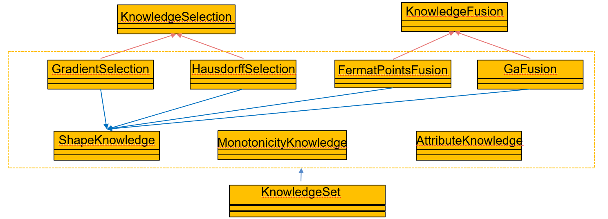

多条目知识
=================================

该部分为多条知识的操作，涉及到知识的读取、查看、筛选和融合。工程知识的筛选是为了将获取的知识中较其他有明显差异的知识筛选出来 
剔除掉，避免由于知识不一致而导致代理模型构建精度不升反降的问题。而工程知识的融合是因为若将众多的工程知识直接融合进代理模型中 
会提升模型计算复杂度，影响代理模型收敛效果。

下图为多条知识操作部分的类图为多条知识部分的类图，代表着对多条知识的融合仿真等操作。KnowledgeSelection和KnowledgeFusion为知识筛选和知识融合的基类。他们的子类代表着不同的知识筛选和融合的方法，
分别为：GradientSection（梯度一致性的筛选）、HausdorffSelection（豪斯托夫距离筛选）、FermatPointsFusion（费马点融合）、GaFusion（遗传算法融合），这些类的实现需要依赖图 2 1中提到的具体的知识类。
最后，为了方便操作，将对知识的所有操作均放在了KnowledgeSet类中，该类依赖于具体的知识类和筛选、融合操作类。

**KnowledgeSet中的属性**

=======  ======  =====================================
名称      类型	  含义
=======  ======  =====================================
pathSet	  list	  每一个储存知识文件路径的集合
typeSet	  list	  每一个知识具体类型的集合
num       int	  待操作所有知识的个数
=======  ======  =====================================

**KnowledgeSet中的方法**

========================  ==============================================================
 名称	                   作用
========================  ==============================================================
readKnowledge()	           将多条知识读取为 dict格式的集合
gradientSelect(dataSet)	   基于梯度一致性的知识筛选筛选，即知识与数据之间的一致性度量
hausdorfSelect()	       基于豪斯多夫距离的知识筛选，即知识与知识之间的一致性度量
fermatPointsFuse()	       基于梯度一致性的知识融合
gaFuse（）	               基于遗传算法的知识融合
========================  ==============================================================

**__init__(*args, folder = None, knowledgeList = None)**

构造函数，将输入转化为属性pathSet、typeSet和num

参数：

* args，类型为str，单个知识的路径，可以重复输入；
* folder，类型为None或者list，使用该参数意味着可以对某个文件夹下的所有知识进行操作；
* knowledgeList，类型为list，为需要操作的多条知识路径组成的集合

示例：::

	from knowledge import KnowledgeSet
	set = Knowledge("C:\data\测试1.txt", "C:\data\测试2.txt", "C:\data\测试3.txt",knowledgeList = ["C:\data\测试4.txt", "C:\data\测试5.txt", "C:\data\测试6.txt"])
	
**readKnowledge() → list**

将多条xml格式的知识文件读取为多个知识dict组成的集合

参数：None

返回：

* knowledgeList，类型为list，为多个知识dict组成的集合

示例：::

	from knowledge import KnowledgeSet
	set = Knowledge("C:\data\测试1.txt", "C:\data\测试2.txt", "C:\data\测试3.txt",knowledgeList = ["C:\data\测试4.txt", "C:\data\测试5.txt", "C:\data\测试6.txt"])
	list = set.readknowledge()

**gradientSelect(dataSet) ‏‏‏→ list**

利用数据和知识之间梯度一致性作为度量指标，来进行知识的筛选（知识与数据的一致性度量）

参数：

* dataSet，类型为dict，包含数据所有信息的字典

返回：

* passList，类型为list，由筛选通过的所有知识dict组成的list

示例：::

	from data import CsvData
	from knowledge import KnowledgeSet
	datapath = “C:\data\测试1.csv”
	D = CsvData (datapath)
	dataSet= D.read ()
	set = Knowledge("C:\data\测试1.txt", "C:\data\测试2.txt", "C:\data\测试3.txt",knowledgeList = ["C:\data\测试4.txt", "C:\data\测试5.txt", "C:\data\测试6.txt"])
	passList = set.gradientSelect(dataSet)

**hausdorfSelect() → list**

利用知识与知识之间的豪斯多夫距离均值作为度量指标，来进行知识的筛选（知识与知识的一致性度量）

参数：None

返回：

* passlist，类型为list，由筛选通过的所有知识dict组成的list

示例： ::

	from knowledge import KnowledgeSet
	set = Knowledge("C:\data\测试1.txt", "C:\data\测试2.txt", "C:\data\测试3.txt",knowledgeList = ["C:\data\测试4.txt", "C:\data\测试5.txt", "C:\data\测试6.txt"])
	passList = set.hausdorfSelect()
	

**上图为知识筛选结果**
	
**fermatPointsFuse(select = None) → dict**

利用费马点进行多条知识的融合

参数：

* select，类型为str，默认为None，可选项有：“g”、“h”。当该参数为默认值None时，代表着将pathSet内的所有知识，直接融合；“g”代表着将使用梯度一致性作为筛选指标筛选通过后的passlist内的知识进行融合，“h”代表着将使用豪斯多夫距离作为筛选指标筛选后的passlist内的知识进行融合。

返回：

* knowledge，类型为dict，所有知识融合后的结果

示例：::

	from knowledge import KnowledgeSet
	set = Knowledge("C:\data\测试1.txt", "C:\data\测试2.txt", "C:\data\测试3.txt",knowledgeList = ["C:\data\测试4.txt", "C:\data\测试5.txt", "C:\data\测试6.txt"])
	know = set . fermatPointsMix(select = “g”)
	
**gaFuse(select = False) → dict**

利用遗传算法进行多条知识的融合

参数：

* select，类型为str，默认为None，可选项有：“g”、“h”。当该参数为默认值None时，代表着将pathSet内的所有知识，直接融合；“g”代表着将使用梯度一致性作为筛选指标筛选通过后的passlist内的知识进行融合，“h”代表着将使用豪斯多夫距离作为筛选指标筛选后的passlist内的知识进行融合。

返回：

* knowledge，类型为dict，所有知识融合后的结果

示例：::

	from knowledge import KnowledgeSet
	set = Knowledge("C:\data\测试1.txt", "C:\data\测试2.txt", "C:\data\测试3.txt",knowledgeList = ["C:\data\测试4.txt", "C:\data\测试5.txt", "C:\data\测试6.txt"])
	know = set . fermatPointsMix()
	

**上图为知识融合结果**
