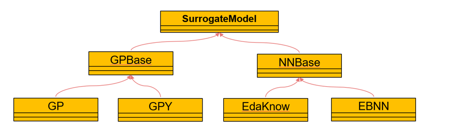

代理模型模块
=================================

代理模型模块的功能为训练代理模型和使用代理模型进行预测。其类图如图 4 1所示：

	
在本工具包中，构建代理模型的方法主要分为高斯过程和神经网络两个大类，分别对应着的是GPBase和NNBase两个类。这两个类的子类均为构造代理模型的具体方法，GP为普通高斯过程、
GPY为融合知识的高斯过程、EdaKnow为融合知识的进化神经网络、EBNN为融合知识的贝叶斯神经网络。

代理模型模块的主要功能
+++++++++++++++++++++++++++
.. toctree::
   :maxdepth: 2

   高斯过程/index
   神经网络/index
   
**SurrogateModel中的API**

============================================   ============================================
名称                                                  作用
============================================   ============================================
setData（dataSet）                              设置训练代理模型所需的数据
setKnowledge（*args，knowList = None）          设置训练代理模型所需要的知识
train(printError = true)                        训练代理模型
predict(x, variance = False)                    利用代理模型预测结果
score(dataSet，index= “MBSE”,error = 0.05)      利用测试数据评价代理模型的精度
save(path)                                      将代理模型保存为pkl文件
============================================   ============================================

**setData（dataSet） → None**

设置训练代理模型所需要的数据

参数：

* dataset，类型为dict，包含着数据信息的dict

返回：None

示例：::

	from surrogatemodel import EBNN
	model = EBNN(“α” = 0.3，“iteration”=3000)        #设置神经网络的学习率为0.3 ，迭代次数为3000
	model.setData(data)     #这里的data为从数据模块中生成的数据dict，前面对应模块处已经详细做过介绍，这里不过多解释

**setKnowledge（*args，knowList = None） → None**

设置训练代理模型所需要的知识

参数：

* args, 类型为dict，需要的知识字典，可以重复输入
* knowledgelist，默认为None，可接受的类型为list，多条知识dict组成的集合。

返回：None

示例：::

	from surrogatemodel import EBNN
	model = EBNN(“α” = 0.3，“iteration”=3000)        #设置神经网络的学习率为0.3 ，迭代次数为3000
	model.setKnowledge(knowList = know)     #这里的know为从知识模块中生成的多条知识dict组成的list，前面对应模块处已经详细做过介绍，这里不过多解释

**train() → None**

训练代理模型

参数：None

返回：None

示例：::

	from surrogatemodel import EBNN
	model = EBNN(“α” = 0.3，“iteration”=30000)        #设置神经网络的学习率为0.3 ，迭代次数为3000
	model.setData(data)     #这里的data为从数据模块中生成的数据dict，前面对应模块处已经详细做过介绍，这里不过多解释
	model.setKnowledge(knowList = know)     #这里的know为从知识模块中生成的多条知识dict组成的list，前面对应模块处已经详细做过介绍，这里不过多解释
	model.train()
 

**predict(x, variance =False)→ numpy.array[nt,ny]或numpy.array[nt,ny],numpy.array[nt,1]**

使用代理模型进行预测

参数：

* x，类型为numpy.array[nt,nx]，nt为需要预测点的数量，nx为预测点输入的维度。预测点的输入矩阵
* variance，类型为bool，默认为False。是否输出预测点对应位置的方差。并非全部的代理模型均可输出方差，仅有例如高斯过程和贝叶斯神经网络此类的模型可以输出方差信息

返回：

* numpy.array[nt,ny]或numpy.array[nt,ny+1]，nt为预测点的数量，ny为预测点输出的维度。numpy.array[nt,ny]是variance为False时的返回，numpy.array[nt,ny+1]时variance为True时的返回，多出的一列记录着预测点的方差信息

示例：::

	from surrogatemodel import EBNN
	model = EBNN(“α” = 0.3，“iteration”=30000)        #设置神经网络的学习率为0.3 ，迭代次数为3000
	model.setData(data)     #这里的data为从数据模块中生成的数据dict，前面对应模块处已经详细做过介绍，这里不过多解释
	model.setKnowledge(knowList = know)     #这里的know为从知识模块中生成的多条知识dict组成的list，前面对应模块处已经详细做过介绍，这里不过多解释
	model.train()
	x = np.linspace(0.0, 4.0, num)          #生成预测点
	y = model.predict(x,variance = True)

**score(dataSet，index = “RSME”,error = 0.05) → numpy.array[ny]**

利用给定的测试数据集，来评价当前代理模型的训练情况

参数：

* dataSet，类型为dict。测试用数据集，包含着数据全部信息的dict
* index，类型为str，可选项有“RSME”、“R2”、“Confidence”。评价代理模型时所使用到的指标，“RSME”为均方误差根，“R2”为R-平方，“Confidence”为一定误差水平下的置信度
* error，类型为float。相对误差，当index = “Confidence”时，将会返回测试集中小于该相对误差下的置信度

返回：

* numpy.array[ny]，在模型的每一个输出维度上，利用测试数据集计算出的所选指标值

示例：::

	from surrogatemodel import EBNN
	model = EBNN(“α” = 0.3，“iteration”=30000)        #设置神经网络的学习率为0.3 ，迭代次数为3000
	model.setData(data_train)     #这里的data_train为从数据模块中生成的数据dict，前面对应模块处已经详细做过介绍，这里不过多解释
	model.setKnowledge(knowList = know)     #这里的know为从知识模块中生成的多条知识dict组成的list，前面对应模块处已经详细做过介绍，这里不过多解释
	model.train()
	confidence = model.score(data_test, index = “Confidence”，error = 0.03)      #这里的data_test为从数据模块中生成的数据dict，前面对应模块处已经详细做过介绍，这里不过多解释

**save(path) → None**

将保存现有的代理模型保存为pkl文件的形式，下次需要使用时利用python中的pickle包进行加载即可

参数：
* path，类型为str，pkl文件的路径和名称信息

返回：None

示例：::

	from surrogatemodel import EBNN
	import pickle
	model = EBNN(“α” = 0.3，“iteration”=30000)        #设置神经网络的学习率为0.3 ，迭代次数为3000
	model.setData(data_train)     #这里的data_train为从数据模块中生成的数据dict，前面对应模块处已经详细做过介绍，这里不过多解释
	model.setKnowledge(knowList = know)     #这里的know为从知识模块中生成的多条知识dict组成的list，前面对应模块处已经详细做过介绍，这里不过多解释
	model.train( printError = True )
	path = “model1.pkl
	model.save(path)               #保存模型
	model2 = None
	filename = "kriging.pkl"
	with open(filename, "rb") as f:
		model2 = pickle.load(f)                   #加载模型

