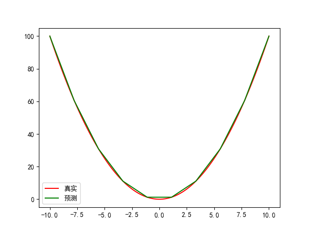

高斯过程
=================================

::
	
	from data.CsvData import CsvData
    from knowledge.KnowledgeSet import KnowledgeSet
    from benchmark.sphere import Sphere

    ndim = 2
    trainNum = 100
    testNum = 10

    x = np.ones((trainNum, ndim))
    x[:, 0] = np.linspace(-10, 10.0, trainNum)
    x[:, 1] = 0.0

    xt = np.ones((testNum, ndim))
    xt[:, 0] = np.linspace(-10, 10.0, testNum)
    xt[:, 1] = 0.0

    s = Sphere()
    trainSet = s(x)
    testSet = s(xt)
    print(testSet)

    # plt.plot(x[:, 0], trainSet["output"][:, 0])

    # 获取知识
    k = KnowledgeSet("C:\data\sphereShapeKnowledge.xml", "C:\data\sphereMonoKnowledge1.xml",
                     "C:\data\sphereMonoKnowledge2.xml")
    
	knowList = k.readKnowledge()
    k.visualKnowledge()

    gpModel = GPK()
    # gpModel = GP()

    gpModel.setData(trainSet)               #设置数据

    gpModel.setKnowledge(knowList=knowList)           #设置知识

    gpModel.train()          #训练

    yp = gpModel.predict(xt)        #预测

    ln1 = plt.plot(x[:, 0], trainSet["output"][:, 0], label ="真实",color = "red")
    ln2 = plt.plot(xt[:, 0], yp[:, 0], label ="预测",color = 'green')
    print(xt[:, 0])
    print(yp[:, 0])
    plt.legend()
    plt.show()

    b = gpModel.score(testSet,index="RSME")  #评价代理模型 ，"RSME", "R2", "MAE", "Confidence"
    print(b)

    gpModel.save(r"C:\data\代理模型训练\高斯过程代理模型.pkl")    #保存模型文件

